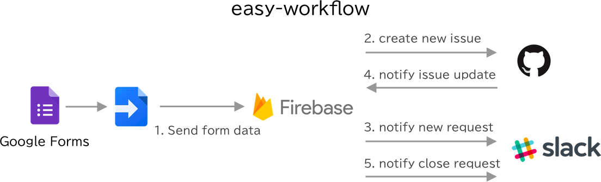

# easy-workflow



## How to use
### 1. Setup local
- 1: Get source code and install libraries.
```shell
$ git clone hoge
$ cd easy-workflow/firebase/functions
$ npm i
```

### 2. Setup Firebase
- 1: Create new firebase project.
- 2: Get firebase app url from console.

### 3. Google Forms
- 1: Create new google form.
- 2: Open script editor. Copy & paste script of `gappsscript/app.gs` .

### 4. GitHub
- 1: Create new repository for workflow ticket.
- 2: Add webhook.

### 5. Deploy firebase app.
- 1: Set default project.
```shell
$ firebase use --add <your_project_id>
```

- 2: Add all config to your firebase project.
```shell
$ firebase functions:config:set \
  basic_auth.user="<your_basi_cauth_user_name>" \
  basic_auth.password="<your_basi_cauth_password>" \
  github.api_token="<github_api_token>" \
  github.asignees.0="<github_issue_asignee_name>" \
  github.issue_url="<https://api.github.com/repos/your_org/your_repo/issues>" \
  github.webhook.secret="<github_webhook_secret>" \
  slack.webhook_url="<slack_incomeing_webhook_url>" \
  slack.contact='<workflow_contact_account_id>' \
  slack.user_search.url="https://slack.com/api/users.lookupByEmail" \
  slack.user_search.token="<your_slack_app_token>"
```

- 3: Check your firebase project's config.
```shell
$ firebase functions:config:get
```

- 4: Run cloud functions in local.
``` shell
$ cd easy-workflow/firebase/functions
$ npm run serve
```

- 5: Deploy cloud functions.
``` shell
$ firebase deploy --only functions
```